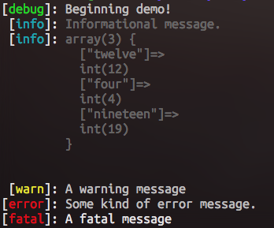

## PHP Drop-in Logger Class

Logger class I wrote to avoid having to use echo, var_dump, etc. in code. 

* Shows Debug, Info, Warning, Error and Fatal messages with color coding
* Accepts strings or objects; objects are automatically var_dump'd and indented.
* Usable as `PHPLogger`; checks if `Log` class is defined, if not, extends to it.
* Single-character overloads for quick use.

### Functions

* `PHPLogger::debug($object)` - Prints [debug]: in green, followed by what was passed in.
* `PHPLogger::info($object)` - Prints [info]: in cyan, followed by what was passed in.
* `PHPLogger::warn($object)` - Prints [warn]: in yellow, followed by what was passed in.
* `PHPLogger::error($object)` - Prints [error]: in red, followed by what was passed in.
* `PHPLogger::fatal($object)` - Prints [fatal]: in bright red, followed by what was passed in.
* `demo()` - Prints a set of pre-defined messages for testing.

### Todos

* Add date/time functionality
* Add ability to write to log files instead of solely to console

[Licensed under MIT](LICENSE)